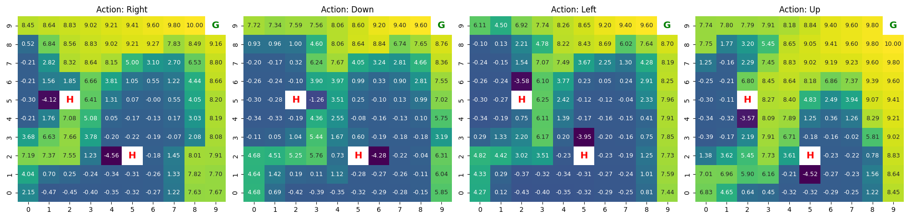

# DQN HomeFood Environment

This project contains a custom Gymnasium environment where a DQN agent navigates a grid world to reach a food goal while avoiding distractions.

## Project Structure
- `home_food_env.py`: Custom Gym environment
- `ASSIGNMENT_1_DATA/`: Image resources
- `main.py`: Entry point for training
- `dqn_agent.py`: DQN agent implementation
   


## Install Dependencies
```bash
pip install -r requirements.txt

## Action-Value Heatmap (Q-values)

The following heatmaps visualize the Q-values learned by the agent for each action:

